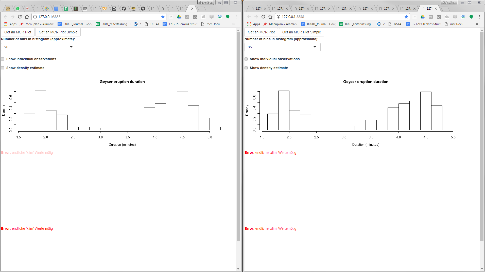

# Promises Tutorial

This is a basic tutorial to use the promises package of Joe Cheng that he 
presented at the EARL conference. The Package can be found on [github](https://github.com/rstudio/promises)

The tutorial will work some basic features of the Package and guide you trough.


# Preparation

## Install R

Please get R>`3.4.2` to run the tutorial. 

## Install necessary Tools

Please install [Rtools](https://cran.r-project.org/bin/windows/Rtools/Rtools34.exe) and
Java development kit [JDK](http://www.oracle.com/technetwork/java/javase/downloads/jdk9-downloads-3848520.html)

You shall add them to your path by using:

```
path_Store <- Sys.getenv("PATH")
Sys.setenv(
  PATH = paste(
    "C:\\_wolfs25\\bioWARP\\r\\R-Versions\\R-3.4.2\\bin\\x64",
    "C:\\Program Files (x86)\\Java\\jre6\\bin",
    "C:\\Program Files\\Java\\jre6\\bin",
    Sys.getenv("PATH"),
    "C:\\RBuildTools/3.4/bin/",
    "C:\\RBuildTools\\3.4\\mingw_64/bin/",
    "C:\\_wolfs25\\bioWARP\\r\\R-Versions\\Rtools\\gcc-4.6.3\\bin",
    sep = ";"
  )
)
```

In here you can see my username (`wolfs25`) and where I installed Rtools and Java. Please change this
part of the tutorial according to your Rtools and Java installation.

## Reset libPath

You might want to run the tutorial in RStudio. Therefore you have to reset your library PATH, as 
RStudio sets it to weird destinations, in my point of view:

```
.libPaths("x")
```

## Set number of cores

```
options(cores=4, parallel=T,mc.cores=4)
```

## Check Tools installation

You may want to check your whole installation. So these two system commands shall give reasonable
outputs:

```
system('where make')
system("g++ -v")

```

# R-packages

The tutorial will be performed with a really difficult regression problem. Therefore you will need the `mcr`  package for Regression. Moreover we need the Github Versions of the `shiny` and the `promises` package. The
`future` package will enable the preparation of promises.

Install Hadley Wickhams devtools to get to Github packages.
```
install.packages("devtools")
``` 

Install Roches `mcr` package
```
install.packages("mcr")
``` 

Install Roches `future` and `magrittr` package
```
install.packages("future")
install.packages("magrittr")
``` 

install the packages from Joey Cheng for asynchronous `shiny` apps
```
devtools::install_github("rstudio/shiny")
devtools::install_github("rstudio/promises")

``` 

# Run the normal app

Step into the directory of this tutorial

```
.libPaths("x")

library(magrittr)
library(mcr)
library(shiny)

runApp("micro_app_old",port = 3838)
```

Now the App opens in a new Browser Window


Click on "Get an MCR Plot Simple"

You should get a regression plot.


Open a new browser Window with the same address.
Click "Get an MCR Plot" and try to change the Geyser Plot in the first App.
It will not work:


This is **normal** shiny behaviour. It will not allow you to work in parallel.

# Run the asynchronous App

```
.libPaths("x")

library(magrittr)
library(future)
library(promises)
library(mcr)
library(shiny)
plan("multisession")

runApp("micro_app",port = 3838)
```

Now the App opens in a new Browser Window


Click on "Get an MCR Plot Simple"

You should get a regression plot.


lick "Get an MCR Plot" and try to open a new browser Window with the same address.
It will not work:


Now, this is the nice feature of the "promises" package.

# How it works:

The promises package allows you to open a second thread for your calculations.
Joey Cheng illustrates it like that:


You can see that a second thread is opened just for the calculation of the `print()` operation
for the model.


The same happens in our application. 

## Oldschool way of shiny programming

The old one generates a plot like this:

```
model <- reactive({
        if(input$train){
          data_hard <- read.csv("../data/dataset_2.csv") 
          out <- mcreg(x=data_hard$method1,y=data_hard$method2,method.reg = "PaBa")
          return(out)
        }else{
          NULL
        }
      }
  )
 
output$secondplot <- renderPlot({
        plot(model())
   })
```

So `model` is an reactive that responds to the train button. It returns an mcr object that contains
the regression result. This object can be plotted.

## Promises way of shiny programming

The new shiny app does it differently. It creates a future outcome of the `mcreg` call.
```
model <- eventReactive(input$train,
                         {
                           future({mcreg(x=data_hard$method1,y=data_hard$method2,method.reg = "PaBa")})

    })
```

This future outcome is just brought into the plot, if it is really finished. Therefore Joey Cheng
introduced the new `%...>%` Operator.

```
 output$secondplot <- renderPlot({
      model() %...>% plot()
    })
```

## That's it

Basically, that's all the promises package allows. Feel free to use the apps and have fun with it.

# Links

Slides of EARL conf:

https://speakerdeck.com/jcheng5/r-promises

Article about the package:

https://medium.com/@joe.cheng/async-programming-in-r-and-shiny-ebe8c5010790